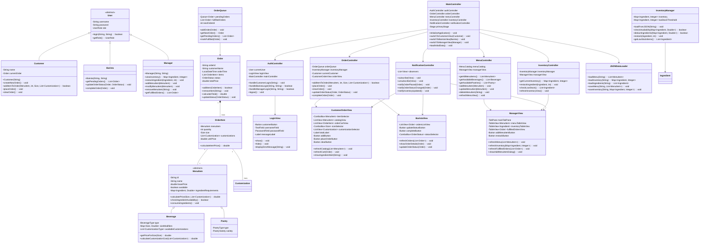

# Overall Class Diagram

```mermaid
classDiagram
    %% Model Layer
    class User {
        <<abstract>>
        -String username
        -String password
        -UserRole role
        +login(String, String): boolean
        +getRole(): UserRole
    }
    
    class Customer {
        -String name
        -Order currentOrder
        +Customer(String)
        +createNewOrder(): void
        +addItemToOrder(MenuItem, int, Size, List~Customization~): boolean
        +placeOrder(): void
        +clearOrder(): void
    }
    
    class Barista {
        +Barista(String, String)
        +getPendingOrders(): List~Order~
        +updateOrderStatus(Order, OrderStatus): void
        +completeOrder(Order): void
    }
    
    class Manager {
        +Manager(String, String)
        +viewInventory(): Map~Ingredient, Integer~
        +restockIngredient(Ingredient, int): void
        +addMenuItem(MenuItem): void
        +modifyMenuItem(MenuItem): void
        +removeMenuItem(String): void
        +getFulfilledOrders(): List~Order~
    }
    
    class MenuItem {
        <<abstract>>
        -String id
        -String name
        -double basePrice
        -boolean available
        -Map~Ingredient, Double~ ingredientRequirements
        +calculatePrice(Size, List~Customization~): double
        +checkIngredientAvailability(): boolean
        +consumeIngredients(): void
    }
    
    class Beverage {
        -BeverageType type
        -Map~Size, Double~ sizeModifiers
        -List~CustomizationType~ availableCustomizations
        +getPriceForSize(Size): double
        +calculateCustomizationCost(List~Customization~): double
    }
    
    class Pastry {
        -PastryType type
        -PastryVariety variety
    }
    
    class Order {
        -String orderId
        -String customerName
        -LocalDateTime orderTime
        -List~OrderItem~ items
        -OrderStatus status
        -double totalPrice
        +addItem(OrderItem): boolean
        +removeItem(String): void
        +calculateTotal(): double
        +updateStatus(OrderStatus): void
    }
    
    class OrderItem {
        -MenuItem menuItem
        -int quantity
        -Size size
        -List~Customization~ customizations
        -double unitPrice
        +calculateItemPrice(): double
    }
    
    class InventoryManager {
        -Map~Ingredient, Integer~ inventory
        -Map~Ingredient, Integer~ lowStockThreshold
        +loadFromJSON(String): void
        +checkAvailability(Map~Ingredient, Double~): boolean
        +deductIngredients(Map~Ingredient, Double~): boolean
        +restock(Ingredient, int): void
        +getLowStockItems(): List~Ingredient~
    }
    
    class OrderQueue {
        -Queue~Order~ pendingOrders
        -List~Order~ fulfilledOrders
        -int nextOrderId
        +addOrder(Order): void
        +getNextOrder(): Order
        +getPendingOrders(): List~Order~
        +markFulfilled(Order): void
    }
    
    %% View Layer
    class LoginView {
        -Button customerButton
        -TextField usernameField
        -PasswordField passwordField
        -Label messageLabel
        +show(): void
        +hide(): void
        +displayErrorMessage(String): void
    }
    
    class CustomerOrderView {
        -ComboBox~MenuItem~ itemSelector
        -ListView~MenuItem~ catalogView
        -ListView~OrderItem~ orderCartView
        -ComboBox~Size~ sizeSelector
        -ListView~Customization~ customizationSelector
        -Label totalLabel
        -Button addButton
        -Button placeOrderButton
        -Button clearButton
        +refreshCatalog(List~MenuItem~): void
        +refreshCart(Order): void
        +showIngredientAlert(String): void
    }
    
    class BaristaView {
        -ListView~Order~ ordersListView
        -Button updateStatusButton
        -Button completeButton
        -ComboBox~OrderStatus~ statusSelector
        +refreshOrders(List~Order~): void
        +showOrderDetails(Order): void
        +updateOrderStatus(Order): void
    }
    
    class ManagerView {
        -TabPane mainTabPane
        -TableView~MenuItem~ menuTableView
        -TableView~Ingredient~ inventoryTableView
        -TableView~Order~ fulfilledOrdersView
        -Button addMenuItemButton
        -Button restockButton
        +refreshMenu(List~MenuItem~): void
        +refreshInventory(Map~Ingredient, Integer~): void
        +refreshFulfilledOrders(List~Order~): void
        +showAddMenuItemDialog(): void
    }
    
    %% Controller Layer
    class AuthController {
        -User currentUser
        -LoginView loginView
        -MainController mainController
        +handleCustomerLogin(String): void
        +handleBaristaLogin(String, String): boolean
        +handleManagerLogin(String, String): boolean
        +logout(): void
    }
    
    class OrderController {
        -OrderQueue orderQueue
        -InventoryManager inventoryManager
        -Customer currentCustomer
        -CustomerOrderView orderView
        +addItemToOrder(MenuItem, int, Size, List~Customization~): boolean
        +placeOrder(): void
        +clearOrder(): void
        +updateOrderStatus(Order, OrderStatus): void
        +completeOrder(Order): void
    }
    
    class MenuController {
        -MenuCatalog menuCatalog
        -ManagerView managerView
        +getAllMenuItems(): List~MenuItem~
        +getAvailableBeverages(): List~Beverage~
        +getAvailablePastries(): List~Pastry~
        +addMenuItem(MenuItem): void
        +updateMenuItem(MenuItem): void
        +deleteMenuItem(String): void
        +refreshMenuView(): void
    }
    
    class InventoryController {
        -InventoryManager inventoryManager
        -ManagerView managerView
        +getCurrentInventory(): Map~Ingredient, Integer~
        +restockIngredient(Ingredient, int): void
        +checkLowStock(): List~Ingredient~
        +refreshInventoryView(): void
    }
    
    class NotificationController {
        -List~View~ observers
        +subscribe(View): void
        +unsubscribe(View): void
        +notifyOrderPlaced(Order): void
        +notifyOrderStatusChanged(Order): void
        +notifyInventoryUpdated(): void
    }
    
    class MainController {
        -AuthController authController
        -OrderController orderController
        -MenuController menuController
        -InventoryController inventoryController
        -NotificationController notificationController
        -Stage primaryStage
        +initializeApplication(): void
        +switchToCustomerView(Customer): void
        +switchToBaristaView(Barista): void
        +switchToManagerView(Manager): void
        +loadInitialData(): void
    }
    
    %% Data Layer
    class JSONDataLoader {
        +loadMenu(String): List~MenuItem~
        +loadInventory(String): Map~Ingredient, Integer~
        +loadIngredients(String): List~Ingredient~
        +saveMenu(String, List~MenuItem~): void
        +saveInventory(String, Map~Ingredient, Integer~): void
    }
    
    %% Relationships
    User <|-- Customer
    User <|-- Barista
    User <|-- Manager
    
    MenuItem <|-- Beverage
    MenuItem <|-- Pastry
    
    Order "1" *-- "many" OrderItem
    OrderItem "1" -- "1" MenuItem
    OrderItem "1" -- "many" Customization
    
    InventoryManager --> Ingredient
    OrderQueue --> Order
    
    MainController --> AuthController
    MainController --> OrderController
    MainController --> MenuController
    MainController --> InventoryController
    MainController --> NotificationController
    MainController --> JSONDataLoader
    
    AuthController --> LoginView
    OrderController --> CustomerOrderView
    OrderController --> BaristaView
    MenuController --> ManagerView
    InventoryController --> ManagerView
    
    NotificationController --> CustomerOrderView
    NotificationController --> BaristaView
    NotificationController --> ManagerView
```