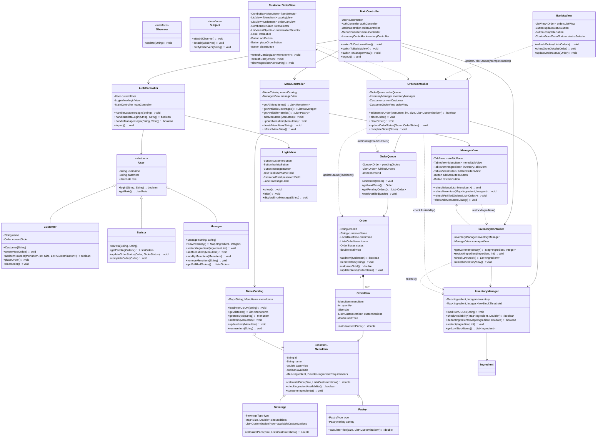

# Class Diagram (Codebase-Aligned)

```mermaid
classDiagram
    %% Core Users
    class User {
        <<abstract>>
        -String username
        -String password
        -UserRole role
        +login(String, String): boolean
        +getRole(): UserRole
    }

    class Customer {
        -String name
        -Order currentOrder
        +Customer(String)
        +createNewOrder(): void
        +addItemToOrder(MenuItem, int, Size, List~Customization~): boolean
        +placeOrder(): void
        +clearOrder(): void
    }

    class Barista {
        +Barista(String, String)
        +getPendingOrders(): List~Order~
        +updateOrderStatus(Order, OrderStatus): void
        +completeOrder(Order): void
    }

    class Manager {
        +Manager(String, String)
        +viewInventory(): Map~Ingredient, Integer~
        +restockIngredient(Ingredient, int): void
        +addMenuItem(MenuItem): void
        +modifyMenuItem(MenuItem): void
        +removeMenuItem(String): void
        +getFulfilledOrders(): List~Order~
    }

    %% Menu Domain
    class MenuItem {
        <<abstract>>
        -String id
        -String name
        -double basePrice
        -boolean available
        -Map~Ingredient, Double~ ingredientRequirements
        +calculatePrice(Size, List~Customization~): double
        +checkIngredientAvailability(): boolean
        +consumeIngredients(): void
    }

    class Beverage {
        -BeverageType type
        -Map~Size, Double~ sizeModifiers
        -List~CustomizationType~ availableCustomizations
        +calculatePrice(Size, List~Customization~): double
    }

    class Pastry {
        -PastryType type
        -PastryVariety variety
        +calculatePrice(Size, List~Customization~): double
    }

    %% Order / Inventory Domain
    class Order {
        -String orderId
        -String customerName
        -LocalDateTime orderTime
        -List~OrderItem~ items
        -OrderStatus status
        -double totalPrice
        +addItem(OrderItem): boolean
        +removeItem(String): void
        +calculateTotal(): double
        +updateStatus(OrderStatus): void
    }

    class OrderItem {
        -MenuItem menuItem
        -int quantity
        -Size size
        -List~Customization~ customizations
        -double unitPrice
        +calculateItemPrice(): double
    }

    class OrderQueue {
        -Queue~Order~ pendingOrders
        -List~Order~ fulfilledOrders
        -int nextOrderId
        +addOrder(Order): void
        +getNextOrder(): Order
        +getPendingOrders(): List~Order~
        +markFulfilled(Order): void
    }

    class InventoryManager {
        -Map~Ingredient, Integer~ inventory
        -Map~Ingredient, Integer~ lowStockThreshold
        +loadFromJSON(String): void
        +checkAvailability(Map~Ingredient, Double~): boolean
        +deductIngredients(Map~Ingredient, Double~): boolean
        +restock(Ingredient, int): void
        +getLowStockItems(): List~Ingredient~
    }

    %% Observer Interfaces Present In Codebase
    class Observer {
        <<interface>>
        +update(String): void
    }

    class Subject {
        <<interface>>
        +attach(Observer): void
        +detach(Observer): void
        +notifyObservers(String): void
    }

    %% Views
    class LoginView {
        -Button customerButton
        -Button baristaButton
        -Button managerButton
        -TextField usernameField
        -PasswordField passwordField
        -Label messageLabel
        +show(): void
        +hide(): void
        +displayErrorMessage(String): void
    }

    class CustomerOrderView {
        -ComboBox~MenuItem~ itemSelector
        -ListView~MenuItem~ catalogView
        -ListView~OrderItem~ orderCartView
        -ComboBox~Size~ sizeSelector
        -ListView~Object~ customizationSelector
        -Label totalLabel
        -Button addButton
        -Button placeOrderButton
        -Button clearButton
        +refreshCatalog(List~MenuItem~): void
        +refreshCart(Order): void
        +showIngredientAlert(String): void
    }

    class BaristaView {
        -ListView~Order~ ordersListView
        -Button updateStatusButton
        -Button completeButton
        -ComboBox~OrderStatus~ statusSelector
        +refreshOrders(List~Order~): void
        +showOrderDetails(Order): void
        +updateOrderStatus(Order): void
    }

    class ManagerView {
        -TabPane mainTabPane
        -TableView~MenuItem~ menuTableView
        -TableView~Ingredient~ inventoryTableView
        -TableView~Order~ fulfilledOrdersView
        -Button addMenuItemButton
        -Button restockButton
        +refreshMenu(List~MenuItem~): void
        +refreshInventory(Map~Ingredient, Integer~): void
        +refreshFulfilledOrders(List~Order~): void
        +showAddMenuItemDialog(): void
    }

    %% Controllers
    class AuthController {
        -User currentUser
        -LoginView loginView
        -MainController mainController
        +handleCustomerLogin(String): void
        +handleBaristaLogin(String, String): boolean
        +handleManagerLogin(String, String): boolean
        +logout(): void
    }

    class MainController {
        -User currentUser
        -AuthController authController
        -OrderController orderController
        -MenuController menuController
        -InventoryController inventoryController
        +switchToCustomerView(): void
        +switchToBaristaView(): void
        +switchToManagerView(): void
        +logout(): void
    }

    class OrderController {
        -OrderQueue orderQueue
        -InventoryManager inventoryManager
        -Customer currentCustomer
        -CustomerOrderView orderView
        +addItemToOrder(MenuItem, int, Size, List~Customization~): boolean
        +placeOrder(): void
        +clearOrder(): void
        +updateOrderStatus(Order, OrderStatus): void
        +completeOrder(Order): void
    }

    class InventoryController {
        -InventoryManager inventoryManager
        -ManagerView managerView
        +getCurrentInventory(): Map~Ingredient, Integer~
        +restockIngredient(Ingredient, int): void
        +checkLowStock(): List~Ingredient~
        +refreshInventoryView(): void
    }

    class MenuController {
        -MenuCatalog menuCatalog
        -ManagerView managerView
        +getAllMenuItems(): List~MenuItem~
        +getAvailableBeverages(): List~Beverage~
        +getAvailablePastries(): List~Pastry~
        +addMenuItem(MenuItem): void
        +updateMenuItem(MenuItem): void
        +deleteMenuItem(String): void
        +refreshMenuView(): void
    }

    class MenuCatalog {
        -Map~String, MenuItem~ menuItems
        +loadFromJSON(String): void
        +getAllItems(): List~MenuItem~
        +getItemById(String): MenuItem
        +addItem(MenuItem): void
        +updateItem(MenuItem): void
        +removeItem(String): void
    }

    %% Relationships
    User <|-- Customer
    User <|-- Barista
    User <|-- Manager

    MenuItem <|-- Beverage
    MenuItem <|-- Pastry

    Order "1" *-- "many" OrderItem
    OrderItem --> MenuItem
    MenuCatalog "1" o-- "many" MenuItem

    OrderQueue --> Order
    InventoryManager --> Ingredient

    MainController --> AuthController
    MainController --> OrderController
    MainController --> MenuController
    MainController --> InventoryController

    AuthController --> LoginView
    AuthController --> User
    OrderController --> OrderQueue
    OrderController --> InventoryManager
    OrderController --> CustomerOrderView
    InventoryController --> InventoryManager
    InventoryController --> ManagerView
    MenuController --> MenuCatalog
    MenuController --> ManagerView

    %% Sequence-diagram interaction dependencies
    BaristaView ..> OrderController : updateOrderStatus()/completeOrder()
    CustomerOrderView ..> OrderController : addItemToOrder()/placeOrder()
    ManagerView ..> InventoryController : restockIngredient()
    OrderController ..> Order : updateStatus()/addItem()
    OrderController ..> OrderQueue : addOrder()/markFulfilled()
    OrderController ..> InventoryManager : checkAvailability()
    InventoryController ..> InventoryManager : restock()
```