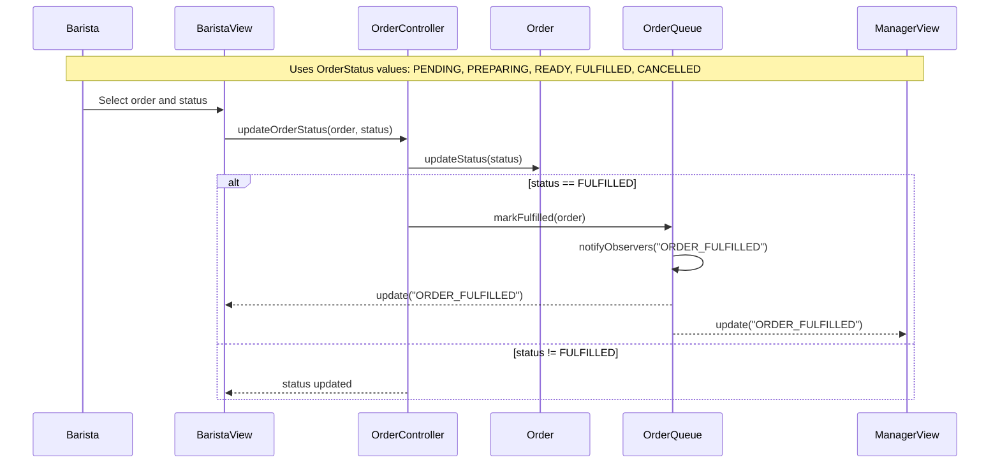
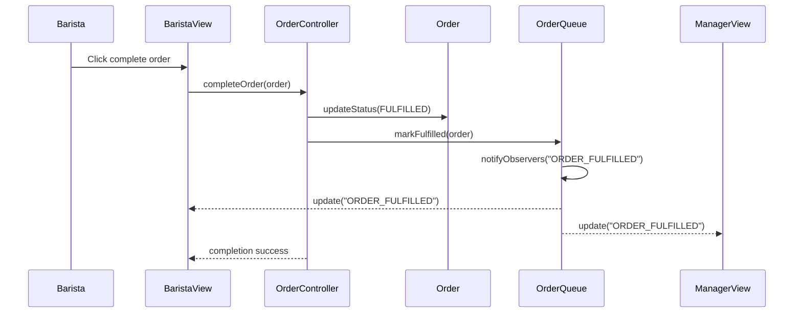
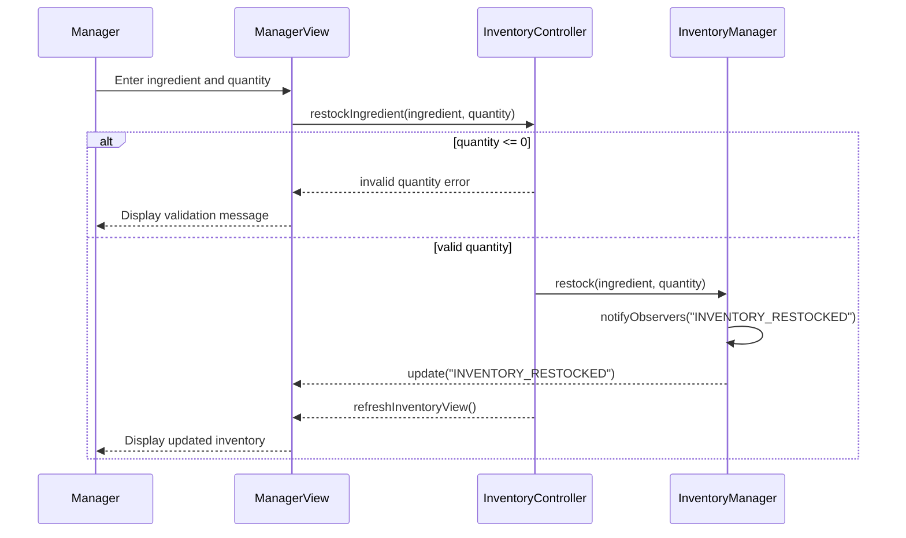
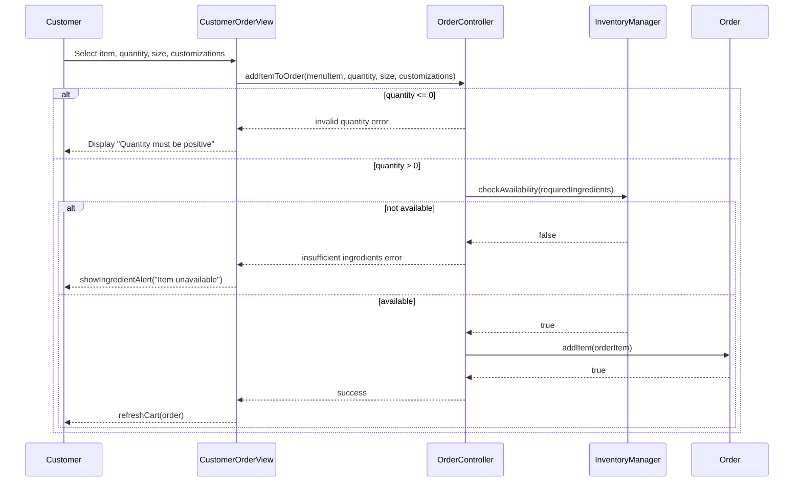
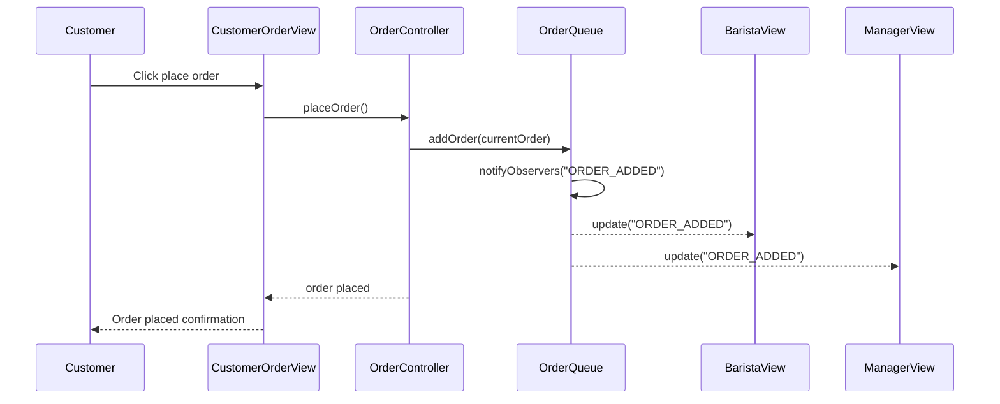

# Barista Updates Order Status

```mermaid
sequenceDiagram
    participant Barista
    participant BaristaView
    participant OrderController
    participant Order
    participant OrderQueue
    participant ManagerView

    Note over Barista,ManagerView: Uses OrderStatus values: PENDING, PREPARING, READY, FULFILLED, CANCELLED

    Barista->>BaristaView: Select order and status
    BaristaView->>OrderController: updateOrderStatus(order, status)
    OrderController->>Order: updateStatus(status)

    alt status == FULFILLED
        OrderController->>OrderQueue: markFulfilled(order)
        OrderQueue->>OrderQueue: notifyObservers("ORDER_FULFILLED")
        OrderQueue-->>BaristaView: update("ORDER_FULFILLED")
        OrderQueue-->>ManagerView: update("ORDER_FULFILLED")
    else status != FULFILLED
        OrderController-->>BaristaView: status updated
    end
```

# Barista Completes Order Flow

```mermaid
sequenceDiagram
    participant Barista
    participant BaristaView
    participant OrderController
    participant Order
    participant OrderQueue
    participant ManagerView

    Barista->>BaristaView: Click complete order
    BaristaView->>OrderController: completeOrder(order)
    OrderController->>Order: updateStatus(FULFILLED)
    OrderController->>OrderQueue: markFulfilled(order)
    OrderQueue->>OrderQueue: notifyObservers("ORDER_FULFILLED")
    OrderQueue-->>BaristaView: update("ORDER_FULFILLED")
    OrderQueue-->>ManagerView: update("ORDER_FULFILLED")
    OrderController-->>BaristaView: completion success
```

# Manager Restocks Inventory Flow

```mermaid
sequenceDiagram
    participant Manager
    participant ManagerView
    participant InventoryController
    participant InventoryManager

    Manager->>ManagerView: Enter ingredient and quantity
    ManagerView->>InventoryController: restockIngredient(ingredient, quantity)

    alt quantity <= 0
        InventoryController-->>ManagerView: invalid quantity error
        ManagerView-->>Manager: Display validation message
    else valid quantity
        InventoryController->>InventoryManager: restock(ingredient, quantity)
        InventoryManager->>InventoryManager: notifyObservers("INVENTORY_RESTOCKED")
        InventoryManager-->>ManagerView: update("INVENTORY_RESTOCKED")
        InventoryController-->>ManagerView: refreshInventoryView()
        ManagerView-->>Manager: Display updated inventory
    end
```

# Customer Adds Item To Order

```mermaid
sequenceDiagram
    participant Customer
    participant CustomerOrderView
    participant OrderController
    participant InventoryManager
    participant Order

    Customer->>CustomerOrderView: Select item, quantity, size, customizations
    CustomerOrderView->>OrderController: addItemToOrder(menuItem, quantity, size, customizations)

    alt quantity <= 0
        OrderController-->>CustomerOrderView: invalid quantity error
        CustomerOrderView-->>Customer: Display "Quantity must be positive"
    else quantity > 0
        OrderController->>InventoryManager: checkAvailability(requiredIngredients)

        alt not available
            InventoryManager-->>OrderController: false
            OrderController-->>CustomerOrderView: insufficient ingredients error
            CustomerOrderView-->>Customer: showIngredientAlert("Item unavailable")
        else available
            InventoryManager-->>OrderController: true
            OrderController->>Order: addItem(orderItem)
            Order-->>OrderController: true
            OrderController-->>CustomerOrderView: success
            CustomerOrderView-->>Customer: refreshCart(order)
        end
    end
```

# Customer Places Order

```mermaid
sequenceDiagram
    participant Customer
    participant CustomerOrderView
    participant OrderController
    participant OrderQueue
    participant BaristaView
    participant ManagerView

    Customer->>CustomerOrderView: Click place order
    CustomerOrderView->>OrderController: placeOrder()
    OrderController->>OrderQueue: addOrder(currentOrder)
    OrderQueue->>OrderQueue: notifyObservers("ORDER_ADDED")
    OrderQueue-->>BaristaView: update("ORDER_ADDED")
    OrderQueue-->>ManagerView: update("ORDER_ADDED")
    OrderController-->>CustomerOrderView: order placed
    CustomerOrderView-->>Customer: Order placed confirmation
```
